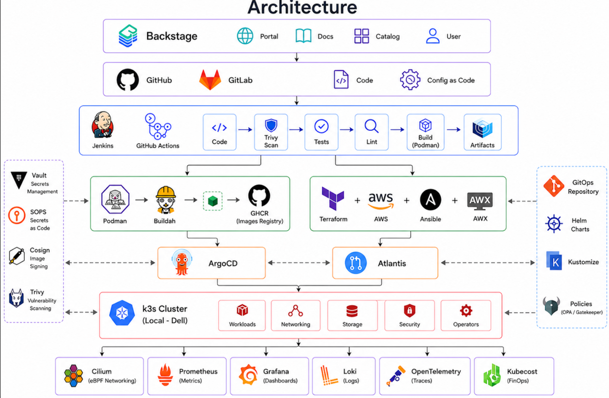

# Architecture and design decisions

This document explains why the platform is shaped the way it is. Where a decision could
reasonably have gone the other way, the alternative is stated along with the reason it was not
chosen.

---

## 1. Goals and non-goals

**Goals**

- One coherent path from a commit to a running, signed, observable workload.
- Every piece of state declared in Git and reconciled automatically.
- Provenance for every image that reaches the cluster.
- A structure a second engineer could pick up without a handover call.

**Non-goals**

- High availability. Single node, on purpose — HA would triple the operational surface and teach
  nothing new about the tooling.
- Multi-tenancy at scale. Namespace isolation is demonstrated, not stress-tested.
- Cost optimisation of the lab itself. AWS usage stays inside the free tier and is destroyed
  after each session.

---

## 2. The two reconciliation loops

The architecture has two independent control loops that share a philosophy but not a domain.

```
Git (cluster manifests)  ──▶  Argo CD   ──▶  Kubernetes API  ──▶  workloads
Git (Terraform HCL)      ──▶  Atlantis  ──▶  AWS API         ──▶  cloud resources
```

Both are pull-based: the reconciler watches Git and converges the target towards it. Neither CI
job holds long-lived credentials for the environment it changes.

The symmetry matters. Once you see Argo CD as "a controller whose desired state happens to live
in Git", Atlantis becomes the same idea applied to a cloud provider, and Crossplane or Terraform
operators become a predictable next question rather than a new concept.

Where they differ: Kubernetes resources are declarative and idempotent by nature, so Argo CD can
reconcile continuously. Terraform mutates external systems that may not tolerate repeated
convergence, so Atlantis gates on a human approving a plan in a pull request. Continuous
reconciliation of infrastructure is not automatically desirable.

---

## 3. The bootstrap boundary

The hardest structural question in a GitOps setup is who deploys the deployer.

`bootstrap/` holds the minimum applied by hand: the k3s installation, the CNI, and Argo CD
itself. Three components, one command each, documented so the cluster can be rebuilt from
nothing.

`platform/` holds everything else, and is owned by Argo CD through an app-of-apps pattern. A
single root Application points at `platform/`, and each subdirectory becomes a child
Application.

The rule: **if removing it would prevent Argo CD from running, it belongs in `bootstrap/`.**
Ingress does not qualify — Argo CD is reachable by port-forward without it. Cilium does, because
without a CNI no pod schedules at all.

The temptation is to move things into `bootstrap/` when a sync breaks and applying it manually is
faster. That is precisely how the boundary erodes and how a cluster becomes unreproducible.

---

## 4. Decision records

### 4.1 k3s rather than kubeadm or a managed cluster

k3s is a single binary, a certified Kubernetes distribution, and starts in under a minute. kubeadm
would have taught more about control plane assembly but consumed days of the budget. A managed
cluster (EKS, AKS) costs roughly €70/month for the control plane alone, which the free tier does
not cover.

The trade-off accepted: k3s bundles opinionated defaults (Traefik, ServiceLB, local-path storage).
Two of the three are overridden below, which forced me to learn what they actually do.

### 4.2 Cilium rather than flannel

flannel provides pod networking and nothing else; network policy in k3s is handled by a separate
controller. Cilium replaces both with an eBPF datapath, and adds identity-based policy,
Hubble observability, and the ability to see flows rather than infer them.

This decision is **not reversible in place**. k3s must be installed with
`--flannel-backend=none --disable-network-policy` from the start. Switching later means
rebuilding the cluster, which is why it sits in step one rather than in the observability phase
where it might feel more at home.

Expected and correct intermediate state: the node reports `NotReady` and CoreDNS stays `Pending`
between the k3s install and the Cilium install. kubelet refuses to advertise readiness without a
network plugin. This is not a failure.

### 4.3 ingress-nginx rather than Traefik

Traefik ships with k3s and would have been free. ingress-nginx was chosen because it is far more
widely deployed in the organisations this platform is modelled on, so its failure modes,
annotations and quirks are the ones worth knowing.

### 4.4 ServiceLB kept, MetalLB rejected

k3s's built-in ServiceLB (klipper-lb) assigns node IPs to `LoadBalancer` services. MetalLB would
be more realistic but adds an address pool, L2 or BGP configuration and another controller to
debug, for no additional insight on a single node. Complexity without a lesson attached is not
worth adding.

### 4.5 Podman and Buildah rather than Docker

Both build rootless and daemonless, which removes the privileged-socket problem that makes
in-cluster Docker builds awkward and unsafe. Buildah also builds without a Dockerfile when
scripting is more natural. Images remain OCI-standard, so nothing downstream cares which tool
produced them.

Secondary reason: the ecosystem this platform mirrors (Red Hat, OpenShift) is Podman-native, and
that overlaps with my internship experience.

### 4.6 Argo CD rather than Flux

Flux is lighter and composes better with Kustomize. Argo CD was chosen for its UI, which makes a
drifted or degraded application visible at a glance — valuable both when learning and when
demonstrating the system to someone else. Its app-of-apps pattern also maps cleanly onto the
`platform/` directory structure.

### 4.7 SOPS before Vault

SOPS encrypts secrets in Git with age or KMS keys. It is a single binary and no server, so it
answers "how do I commit a secret safely" in an afternoon.

Vault answers a different and larger question: dynamic credentials, leases, revocation, and
policies. It is worth the effort, but sequencing SOPS first means the platform never has an
unencrypted secret in Git at any point in its history — which matters, because Git remembers.

### 4.8 Policy engine: undecided

Gatekeeper is the CNCF-graduated option and uses Rego, which is powerful and awkward. Kyverno
writes policies as Kubernetes resources in YAML, which is far more approachable and increasingly
common. The diagram says Gatekeeper; the decision is deferred until the policies themselves are
specified, since the choice should follow the requirement rather than lead it.

---

## 5. Supply chain

```
commit
  └─▶ Trivy scan (filesystem, dependencies, IaC misconfiguration)
        └─▶ unit tests, lint
              └─▶ Buildah build
                    └─▶ Trivy scan (image layers)
                          └─▶ Cosign sign (keyless, OIDC)
                                └─▶ push to GHCR
                                      └─▶ Argo CD deploys
                                            └─▶ admission policy verifies signature
```

The last arrow is what makes the chain meaningful. Signing an image changes nothing unless
something refuses to run unsigned ones; the verification step at admission is the control, and the
signature is only evidence.

Trivy runs twice deliberately: once against source and IaC, where a fix is cheap, and once against
the built image, which contains base-layer packages that source scanning never sees.

---

## 6. Known limitations

- **Single node.** No scheduling pressure, no node failure, no cross-node network path. Cilium's
  more interesting behaviour is invisible here.
- **No real traffic.** Dashboards are structurally correct but describe an idle system. Alert
  thresholds are guesses.
- **Cloud footprint is minimal.** VPC, EC2, S3 and remote state locking — enough to demonstrate
  Terraform state management and module structure, not enough to demonstrate cloud architecture.
- **Azure is absent.** Only AWS is implemented. The Terraform concepts transfer; the provider
  specifics do not.
- **Backstage is a facade over a small catalog.** With a handful of services registered, it
  demonstrates the pattern rather than the value, which only appears at organisational scale.

---

## 7. Bootstrap order

The order is a dependency chain, not a preference.

1. **k3s** without CNI, without Traefik.
2. **Cilium** — the node becomes `Ready` here.
3. **ingress-nginx** and **cert-manager** — HTTP entry and TLS.
4. **Argo CD** — the last thing installed by hand.
5. **Root Application** pointing at `platform/`. Everything after this is a commit, not a command.

Steps 1 and 2 cannot be reordered or separated. Step 4 must follow 3 only if Argo CD is exposed
through ingress rather than port-forward.
